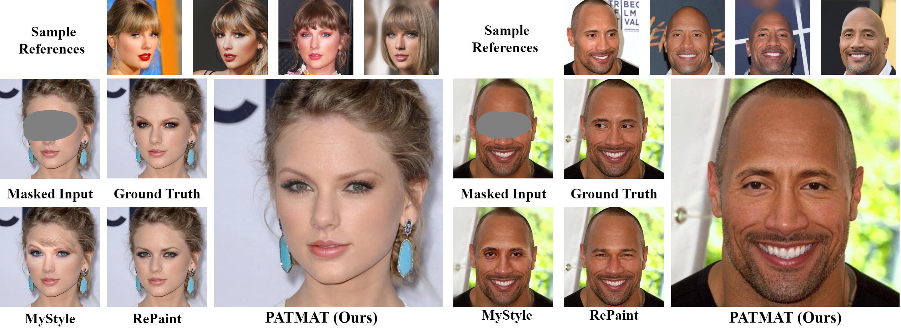

# PATMAT Person Aware Tuning of Mask Aware Transformer for Face Inpainting    (ICCV 2023)

<!-- > Generative models such as StyleGAN2 and Stable Diffusion have achieved state-of-the-art performance in computer vision tasks such as image synthesis, inpainting, and de-noising. However, 
current generative models for face inpainting often fail to preserve fine facial details and the identity of the person, despite creating aesthetically convincing image structures and textures.
In this work, we propose Person Aware Tuning (PAT) of Mask-Aware Transformer (MAT) for face inpainting, which addresses this issue. Our proposed method, PATMAT, effectively preserves identity by
incorporating reference images of a subject and fine-tuning a MAT architecture trained on faces. By using ~40 reference images, PATMAT creates anchor points in MAT's style module, and tunes the model
using the fixed anchors to adapt the model to a new face identity. Moreover, PATMAT's use of multiple images per anchor during training allows the model to use fewer reference images than competing methods.
We demonstrate that PATMAT outperforms state-of-the-art models in terms of image quality, the preservation of person-specific details, and the identity of the subject. Our results suggest that PATMAT can be a promising approach for improving the quality of personalized face inpainting. -->

<a href="https://arxiv.org/abs/2304.06107"></a>
<a href="https://opensource.org/licenses/MIT"></a>  

<p align="center">
  
<br>
PATMAT enables personalization of Mask-Aware Transformer model, provided refrence images of a face.
</br>
</p>

## Description   
Our two-step framework; PAT and MAT build extensively on Pivot Tuning's (PTI) paper + code and MAT's paper + code. 
## Getting Started

### Installation
1. Clone the repository.
    ```shell
    git clone https://github.com/humansensinglab/PATMAT
    ```
2. Install the dependencies.
    - Python 3.7
    - PyTorch 1.7.1
    - Cuda 11.0
    - Other packages
    ```shell
    pip install -r requirements.txt
    ```

## Pretrained Models
Please download the pretrained models from the following links.

### Auxiliary Models for PAT
various auxiliary models needed for PAT inversion task.  
This includes the StyleGAN generator and pre-trained models used for loss computation.
| Path | Description
| :--- | :----------
|[FFHQ StyleGAN](https://nvlabs-fi-cdn.nvidia.com/stylegan2-ada-pytorch/pretrained/ffhq.pkl) | StyleGAN2-ada model trained on FFHQ with 1024x1024 output resolution.
|[Dlib alignment](https://drive.google.com/file/d/1HKmjg6iXsWr4aFPuU0gBXPGR83wqMzq7/view?usp=sharing) | Dlib alignment used for images preproccessing.
|[FFHQ e4e encoder](https://drive.google.com/file/d/1ALC5CLA89Ouw40TwvxcwebhzWXM5YSCm/view?usp=sharing) | Pretrained e4e encoder. Used for StyleCLIP editing.
| Glinnt360k can be downloaded from this link: https://drive.google.com/file/d/1pRDYnndOUemVrZaFV6ZGpH3eQowQpQlL/view?usp=sharing |
### Auxiliary Models for MAT
MAT repo provides models trained on CelebA-HQ, FFHQ and Places365-Standard at 512x512 resolution. Download models from [One Drive](https://mycuhk-my.sharepoint.com/:f:/g/personal/1155137927_link_cuhk_edu_hk/EuY30ziF-G5BvwziuHNFzDkBVC6KBPRg69kCeHIu-BXORA?e=7OwJyE) and put them into the 'pretrained' directory. 
Note: The StyleGAN model is used directly from the official [stylegan2-ada-pytorch implementation](https://github.com/NVlabs/stylegan2-ada-pytorch).
For StyleCLIP pretrained mappers, please see [StyleCLIP's official routes](https://github.com/orpatashnik/StyleCLIP/blob/main/utils.py)


By default, we assume that all auxiliary models are downloaded and saved to the directory `pretrained_models`. 
However, you may use your own paths by changing the necessary values in `configs/path_configs.py`. 


### Running PAT
The main training script is `PAT/scripts/run_pat.py`. The script receives aligned and cropped images from paths configured in the "Input info" subscetion in
 `configs/paths_config.py` where you can also find out about the data structure and file naming convention. I am hoping to make thgis step more user friendly but for now please bear with me.
Results are saved to directories found at "Dirs for output files" under `configs/paths_config.py`. This includes inversion latent codes and tuned generators. 
The hyperparametrs for the inversion task can be found at  `configs/hyperparameters.py`.


### Running MAT
To inpaint desired images after tuning your network with PAT, you can run:
```shell
    python generate_image.py --network model_path --dpath data_path --refpath reference_path --outdir out_path [--mpath mask_path]
```
where ```model_path``` is the path to PAT's output model and ```reference_path``` is a few reference images of the identity you are inpainting (*can be a subset of PAT's training data).

## Credits

**Pivot Tuning and implementation:**  
[https://github.com/richzhang/PerceptualSimilarity ](https://github.com/danielroich/PTI) 

**MAT model and implementation:**   
[https://github.com/omertov/encoder4editin](https://github.com/fenglinglwb/MAT)g

**StyleGAN2-ada model and implementation:**  
https://github.com/NVlabs/stylegan2-ada-pytorch
Copyright © 2021, NVIDIA Corporation.  
Nvidia Source Code License https://nvlabs.github.io/stylegan2-ada-pytorch/license.html

## Acknowledgments
This repository structure is based on MAT and Pivot Tuning

## Contact
For any inquiry please contact us at our email addresses: sam(dot)motamed(at)insait(dot)ai


## Citation
If you use this code for your research, please cite:
```
@InProceedings{Motamed_2023_ICCV,
    author    = {Motamed, Saman and Xu, Jianjin and Wu, Chen Henry and H\"ane, Christian and Bazin, Jean-Charles and De la Torre, Fernando},
    title     = {PATMAT: Person Aware Tuning of Mask-Aware Transformer for Face Inpainting},
    booktitle = {Proceedings of the IEEE/CVF International Conference on Computer Vision (ICCV)},
    month     = {October},
    year      = {2023},
    pages     = {22778-22787}
}
```
